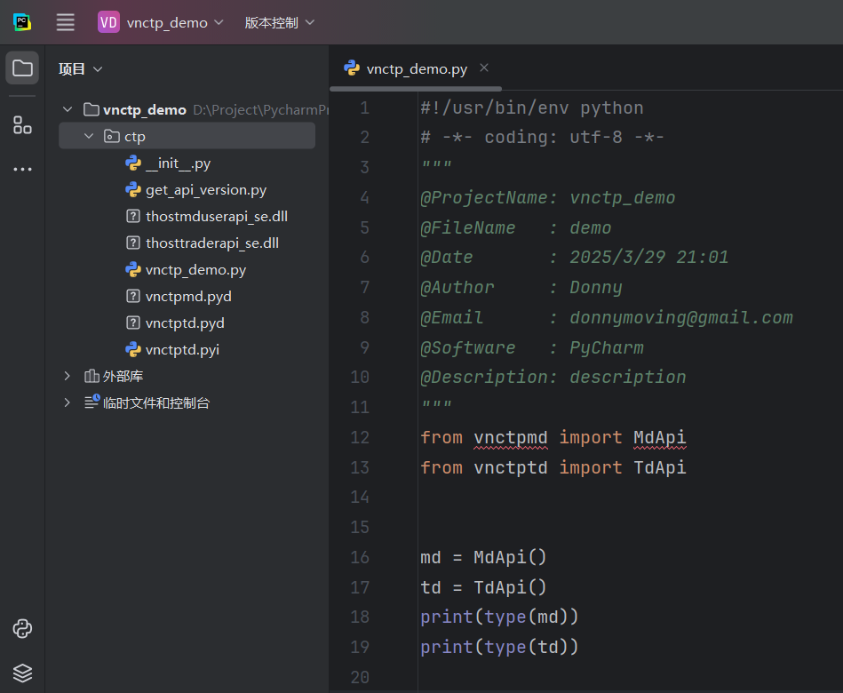

中文 | [ENGLISH](README_EN.md)

# vnpy 使用的 vnctp 封装

### 1. 环境配置

- Windows
- Python>=3.10
- Visual Studio>=2017
- pybind11
- cmake
- vnpy CTP版本：`v6.7.2_20230913`

安装 cmake [下载地址](https://cmake.org/download/ )

Python和cmake配置好环境变量

安装pybind11

```bash
pip install pybind11
```

我自己的环境：

- Windows 11
- Python `3.12.9`
- Visual Studio 2022
- pybind11 `2.13.6`
- cmake `4.0.0`

### 2. 编译

运行 build.bat 脚本将会自动编译完成，在 .\target\Release\ 下编译出 vnctpmd.pyd 和 vnctptd.pyd，分别是行情接口文件和交易接口文件。

``` bash
build.bat
```

### 3. 使用

见demo目录下，将vnctpmd.pyd 和 vnctptd.pyd 复制出来， 和 thostmduserapi_se.dll、thosttraderapi_se.dll 放在同一目录，新建vnctp_demo.py

```python
from vnctpmd import MdApi
from vnctptd import TdApi


md = MdApi()
td = TdApi()
print(type(md))
print(type(td))
```

输出：

```
<class 'vnctpmd.MdApi'>
<class 'vnctptd.TdApi'>
```

新建 get_api_version.py

```python
from vnctpmd import MdApi
from vnctptd import TdApi


md = MdApi()
td = TdApi()

print("MdApi Version:" + md.getApiVersion())
print("TdApi Version:" + td.getApiVersion())
```

输出：

```
MdApi Version:v6.7.2_20230913 10:48:10.4926
TdApi Version:v6.7.2_20230913 10:48:10.4926
```

### 关于 getApiVersion

本项目中使用 .cpp 源文件和 .h 头文件：vnctpmd.h、vnctpmd.cpp、vnctptd.h、vnctptd.cpp 为添加 getApiVersion 函数后的文件，因为在原始文件中没有 getApiVersion 函数，为了便于在 Python 示例代码中调用 CTP API 时可以调用获取 API 版本的函数，在这些文件中添加了 getApiVersion 函数。

### 4. 生成 vnctpmd 和 vnctptd 存根

生成 vnctpmd 和 vnctptd 存根是为了在 Python 代码中导入 vnctpmd 和 vnctptd 模块时避免提醒未解析的引用错误，虽然提示这个错误不影响代码运行。

存根文件一般以.pyi结尾，具体情况可以进一步学习。

作者使用了 miniconda，Python 虚拟环境名为 python312，所以用 conda 激活 Python 环境或者直接在 PyCharm 项目中打开终端执行：

```bash
activate python312
```

#### 安装工具

安装 pybind11-stubgen 库

```bash
pip install pybind11-stubgen
```

pybind11-stubgen 是一个将`.pyd` 文件生成基础存根的库，这样用户在导入模块时，PyCharm 和 VSCode 等工具可以自动识别这些存根，提供类型提示。如果使用构建工具如 uv、poetry 的脚本功能，可以通过 setup.py 添加自定义命令来运行 pybind11-stubgen，可以将 `pybind11-stubgen` 的存根生成步骤集成到项目的构建流程中，并通过 **`pyproject.toml`** 和 **`setup.py`**配置实现自动化。

#### 将 vnctpmd.pyd 和 vnctptd.pyd 所在路径设置到 Python 路径中

```bash
set PYTHONPATH=.
```

或者(`D:\Project\PycharmProjects\vnctp_demo\ctp` 是 vnctpmd.pyd、vnctptd.pyd、thostmduserapi_se.dll、thosttraderapi_se.dll 所在的目录的路径)

```
set PYTHONPATH=D:\Project\PycharmProjects\vnctp_demo\ctp
```

#### 生成 vnctpmd 和 vnctptd 存根

```bash
pybind11-stubgen vnctpmd -o .
pybind11-stubgen vnctptd -o .
```

.pyi 是存根文件后缀名，有存根文件和没存根的区别，下图 vnctpmd 没有存根，vnctptd 有存根在代码中的提示：



#### QQ交流群：446042777(澄明期货研究)